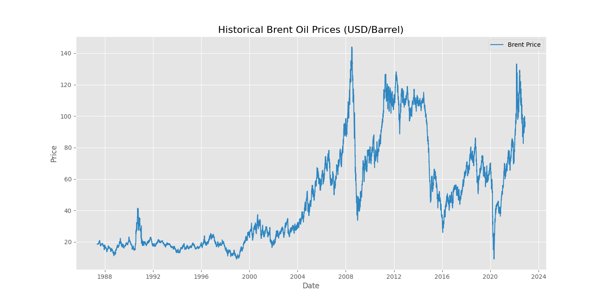
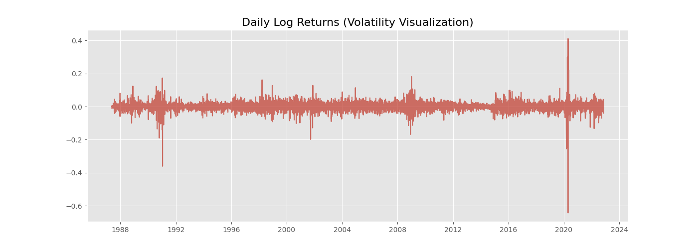

# Interim Report: Brent Oil Price Change Point Analysis
**Date:** February 8, 2026
**Project:** Bayesian Market Regime Analysis
**Consultancy:** Birhan Energies

---

## 1. Business Objective
As a specialized data consultancy, **Birhan Energies** aims to provide high-fidelity, data-driven insights for the global energy sector. The core objective of this project is to analyze the sensitivity of **Brent crude oil prices** to significant global shocks, including geopolitical conflicts, OPEC policy shifts, and economic crises.

The global energy market is characterized by extreme complexity and non-linear fluctuations. Our primary stakeholders—**Investors, Policymakers, and Energy Companies**—require robust evidence to inform:
*   **Investment Strategies**: Identifying shifts in long-term price regimes and risk premiums.
*   **Policy Development**: Understanding how sanctions and regional conflicts structurally alter energy security and market stability.
*   **Operational Planning**: Adjusting supply chains and production schedules in response to detected "new normals" in volatility.

This analysis matters because pinpointing the exact timing and magnitude of structural breaks allows stakeholders to navigate market regime shifts with statistical confidence rather than relying on reactive intuition.

---

## 2. Discussion of Completed Work: Task 1

### 2.1 Data Analysis Workflow
We have established a rigorous five-step Bayesian workflow:
1.  **Data Ingestion**: Standardizing historical records (1987-2022).
2.  **Exploratory Data Analysis (EDA)**: Validating time-series properties (Stationarity, Volatility).
3.  **Bayesian Modeling**: Defining latent switch point ($\tau$) and regime parameters ($\mu, \sigma$) in PyMC.
4.  **Inference**: Executing MCMC sampling to generate posterior distributions.
5.  **Event Correlation**: Mapping detected breaks to the curated event dataset.

### 2.2 Event Research
A structured dataset of 15 pivotal market events was compiled (see `data/raw/events.csv`). Key events include the **First Gulf War (1990)**, the **2008 Global Financial Crisis**, the **2020 COVID-19 Lockdown**, and the **2022 Russia-Ukraine War**. These represent exogenous shocks capable of triggering structural breaks in price dynamics.

### 2.3 Time Series Analysis & EDA Findings
Our initial analysis reveals critical properties of the Brent dataset, providing the empirical foundation for our modeling choices:

#### Price Trend Analysis
The long-term price series (1987-2022) demonstrates distinct market regimes. As shown in **Figure 1**, clear structural shifts are visible following major disturbances. The transition from the relatively stable prices of the 1990s to the high-volatility "super-cycle" of the mid-2000s is particularly prominent.

#### Stationarity Testing
Using the Augmented Dickey-Fuller (ADF) test, we verified:
*   **Raw Prices**: Non-stationary ($p \approx 0.29$). Direct modeling of price levels would likely yield spurious results.
*   **Log Returns**: Highly stationary ($p \approx 2.5 \times 10^{-29}$). Returns are more statistically suitable for change point detection.

#### Volatility Patterns
**Figure 2** visualizes the daily log returns, highlighting "volatility clustering." This phenomenon—where large price changes are followed by more large changes—is strongly associated with exogenous shocks like the Gulf War, the 2008 Financial Crisis, and the 2020 Pandemic.

---

### 2.4 Change Point Model Understanding
Structural breaks are identified via **Bayesian Change Point Modeling**. Unlike frequentist tests that require assuming a date, our model treats the "Switch Point" ($\tau$) as a random variable. We expect the model to output a **probability distribution** of when a shift likely occurred, allowing us to quantify the exact degree of price and risk change ($Z\%$ shift) before and after the event.

### 2.5 Assumptions & Limitations: Correlation vs. Causality
We explicitly assume piecewise stationarity and normal likelihood for returns. Crucially, we distinguish that a detected change point indicates **temporal correlation**. Birhan Energies emphasizes that while a break might overlap with an OPEC decision, proving **causal impact** requires additional structural variables (storage, demand metrics) beyond historical price action alone.

---

## 3. Next Steps & Roadmap

### Task 2: Model Implementation & Refinement
The focus shifts to building the **PyMC Bayesian Model**. We will:
*   Define the `DiscreteUniform` prior for the switch point $\tau$.
*   Run the **NUTS MCMC Sampler** and perform convergence checks ($\hat{R} \approx 1.0$).
*   Quantify the impact of specific events by measuring posterior shifts in $\mu_1 \to \mu_2$.

### Task 3: Interactive Dashboard Development
To deliver these insights to Birhan Energies' clients, we will develop a full-stack application:
*   **Backend (Flask)**: API endpoints to serve historical data and posterior statistics.
*   **Frontend (React)**: An interactive interface featuring date filters, event highlighting, and hover-enabled volatility metrics to allow stakeholders to explore historical "What-If" scenarios.

---
**Prepared by:** Birhan Energies Consultancy Team
**Status:** Task 1 Complete | Task 2 In-Progress
