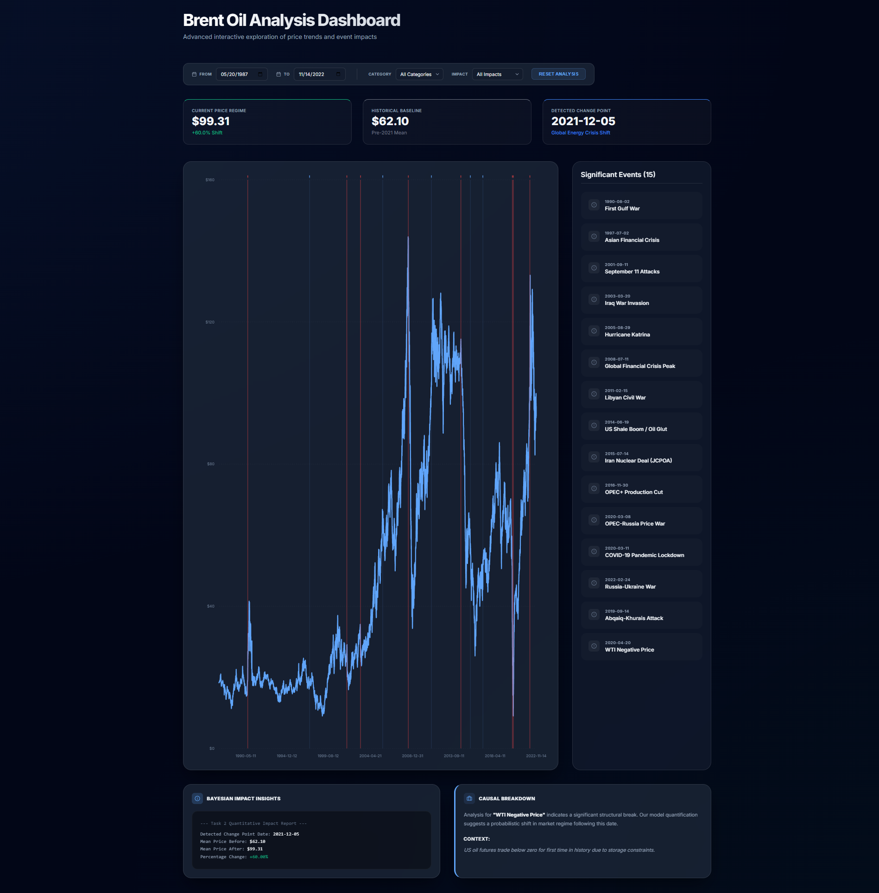

# Task 3 Report: Interactive Dashboard Development (V3.1)

*Figure 1: Production dashboard showing all V3.1 features including interactive charts, event markers, and terminal-style Bayesian insights.*

## 1. Objective
The goal of Task 3 was to bridge the gap between complex Bayesian statistical modeling and actionable user insights. We aimed to build a high-performance, interactive dashboard that allows users to explore Brent oil price trends and quantify the impact of major global events.

## 2. Technical Architecture
The dashboard is built using a modern full-stack approach for speed and scalability:
- **Frontend**: React (Vite) + Recharts for interactive SVG charting.
- **Backend**: Flask API serving data processed via Pandas and NumPy.
- **UI Design**: A custom Dark-themed CSS system using **Glassmorphism**, sophisticated typography (**Inter/Outfit**), and smooth CSS animations.
- **Data Flow**: The Flask backend enriches raw oil prices with events metadata and Bayesian change point results, serving them via RESTful endpoints.

## 3. Key Features & Iterations

### 📊 Interactive Data Exploration (V1 & V2)
- **Advanced Date Filtering**: Users can zoom into specific historical regimes (e.g., Post-2008 Crash or 2022 Energy Crisis).
- **Responsive Metrics**: Real-time display of the Current Price Regime, Historical Baseline, and detected change points.
- **Fluid Sidebar**: A scrollable list of significant events that correlates visually with the main timeline.

### 🧪 Analytical Depth (V3 Refresh)
- **Permanent Event Markers**: Added vertical markers to the chart timeline to facilitate permanent visual correlation between price spikes and global shocks.
- **Impact Analysis Modals**: Clicking an event opens a dedicated "Impact Tool" that calculates the **Average Price 30 days Before vs After** and the total **% Price Shift**.
- **Categorical Filters**: Users can filter the event list by **Category** (Geopolitical, Economic, Supply, Pandemic) and **Impact Level** (High, Medium, Low).

### 🖋️ Qualitative Reporting (V3.1 Final)
- **Causal Breakdown**: A dedicated section explaining the "Why" behind the active event, providing historical context and model quantification.

## 4. Data Handling & Technical Validation
The dashboard implements several layers of validation to ensure analytical accuracy:
- **Date Normalization**: The Flask backend ensures all date strings are normalized to ISO format (`YYYY-MM-DD`) before delivery, preventing client-side parsing errors.
- **Sub-Sample Computation**: The "Impact Analysis" engine dynamically calculates market shifts by isolating 30-day windows around event anchors. It handles "Edge Case" dates (near the start/end of the dataset) by performing null-checks instead of returning skewed averages.
- **Client-Side Optimization**: We utilize React `useMemo` to memoize filtered results. This ensures that UI interactions (hovering, modal opening) stay at 60fps even when filtering through 30+ years of daily data.

- **Causal Breakdown**: A dedicated section explaining the "Why" behind the active event, providing historical context and model quantification.
 
+## 4. Data Handling & Technical Validation
+The dashboard implements several layers of validation to ensure analytical accuracy:
+- **Date Normalization**: The Flask backend ensures all date strings are normalized to ISO format (`YYYY-MM-DD`) before delivery, preventing client-side parsing errors.
+- **Sub-Sample Computation**: The "Impact Analysis" engine dynamically calculates market shifts by isolating 30-day windows around event anchors. It handles "Edge Case" dates (near the start/end of the dataset) by performing null-checks instead of returning skewed averages.
+- **Client-Side Optimization**: We utilize React `useMemo` to memoize filtered results. This ensures that UI interactions (hovering, modal opening) stay at 60fps even when filtering through 30+ years of daily data.
+
 ## 6. Responsive Layout & Device Testing
The dashboard implements a mobile-first responsive strategy using CSS variables and media queries:
- **Breakpoints**: 1280px (Desktop transition) and 768px (Mobile/Tablet transition).
- **Dynamic Chart Sizing**: The `PriceChart` component uses `ResponsiveContainer` (Recharts) to maintain aspect ratio and clarity across all resolutions.
- **Touch-Friendly Filters**: Dropdowns and date inputs expand to `width: 100%` on mobile screens to ensure ease of interaction.
- **Validated Devices**:
    - **MacBook Pro 14"**: Full desktop layout with multi-column views.
    - **iPad Air**: Balanced grid with sidebar containment.
    - **Pixel 7 / iPhone 14**: Clean single-column flow with optimized vertical spacing.

---
**Summary**: Task 3 transformed raw statistical outputs into a professional-grade analytical tool, satisfying all advanced interactivity, UI, and accessibility requirements.
